**SSM Oveview**

- It is a service that is designed to help manage EC2 and on-prem instances
- It allows for patch automation as well as operational insight for running instances
- Works for both Linux and Windows
- It integrates with other AWS services such as:
  - Config 
  - Cloudwatch
- It is a free service
- How it works:
  - First you need to instal an SSM agent onto your instances which will allow for communication back to the SSM service (this comes pre-built in AWS Linux AMI)
  - Once the SSM agent has been installed it will automatically be configured to talk back to the service.  If not then there is a comms issue or maybe the instance doesnt have the correct IAM permissions or the SSM agent is not running

**EC2 Instances with SSM**

- Here we demostrate how SSM works by creating 3 instances from AWS Linux AMI which have the SSM agent installed already
- Created a role in IAM for EC2 instances to be able to communicate with SSM


- Assigned to the instances


- I also created some test tags:
  - Team - Finance/Ops
  - Env - Prod/Dev


- Once the IAM role is in place the instances will talk back to SSM and show up under Managed Instances


- Just as a note I created the instances with a completely empty SG which means no traffic is allowed in to the instances.  The way that SSM works is via the the Agent installed on the instances thus requiring no SSH to be opened


**AWS Tags & Resource Groups**

- In the previous section I tagged the instances and those tags will help us interact with them via SSM, also the tags are useful for creating Resource Groups which are a way of logically partitioning instances
- Tags are used for the following (as a rule of thumb is better to have too many tags than too few):
  - Resource Groups
  - Cost Allocation
  - Automation
  - SSM
- Resource Groups are Region centric so you can’t create Resource Groups that span across multiple Regions
- I then created some Resource Groups which will include the tags that I previously assigned to the 3 test Instances


- Once you have Resource Groups created you can run Tasks against them in SSM.  Think of this like running a playbook against Instances in inventory in Ansible

**SSM Documents & SSM Run Command**

- SSM Documents can be defined in either YAML or JSON.  There are plenty of built in ones to pick and use as starting point

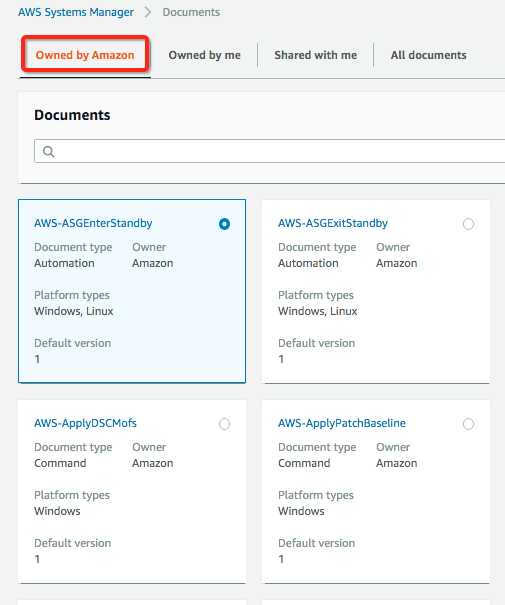

- The basic structure of these is:
  - Parameters
  - Actions
- A Document is the Central piece to the SSM Automation as they dictate what Actions to take and thus what service within SSM needs to be called upon

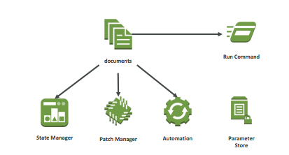

- A Document is basically like a playbook that defines Actions that will be taken against instances using Resource Groups
- What we are going to do now is demo how it works by:
  - Create a Document (YAML) which will be used by the Run Command
```bash
---
schemaVersion: '2.2'
description: State Manager Bootstrap Example
parameters: {}
mainSteps:
- action: aws:runShellScript
  name: configureServer
  inputs:
    runCommand:
    - sudo yum install -y httpd
    - sudo systemctl start httpd
    - sudo systemctl enable httpd
```
- This will install httpd on each of the instances
- The Run Command will be executed against a Resource group created previously

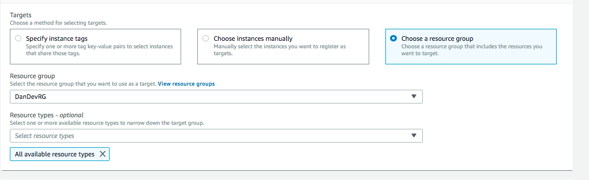

- We will leave the Parallelism and Error threshold as they are
- Once ran I opened up port 80 inbound and checked I could access the home page of the test webserver

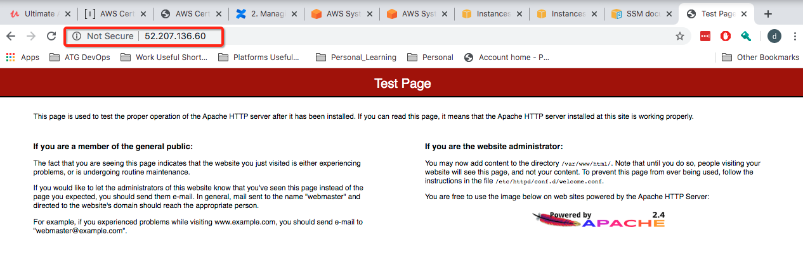

**SSM Inventory and Patches**

- There are multiple ways in SSM that you can patch instances and keep them compliant:
  - Inventory - allows you to gather all installed SW on instances that have the SSM agent installed.  How it works is that you setup and inventory by either Tag, Name, All instances etc and once the Inventory is up and running State Manager kicks in and runs AWS-GatherSoftwareInventory.  once the Inventory has been created you can review the SW installed on your instances from the Managed Instances section

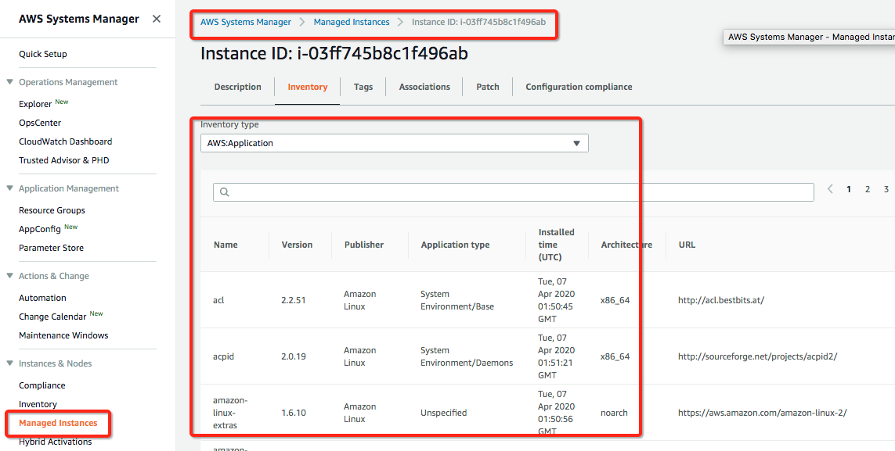

- Inventory + Run Command - allows you to gather all installed SW (as stated above) and then subsequently patch
- Patch Manager + Maintenance Windows - Keeps Instances compliant.  You create baselines and via the use of maintenance Windows you can automatically keeps your Systems at you desired Patch level.  Once you have the following defined and Patch Manager kicks off patching it will trigger the Run Command to patch the instances.  If Instances are compliant with the Patch Baseline you have defined they wont be patched, if not they will be patched.  the results will be shown in the Compliance section

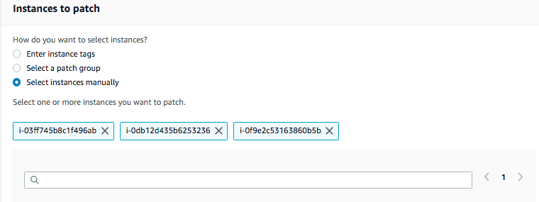

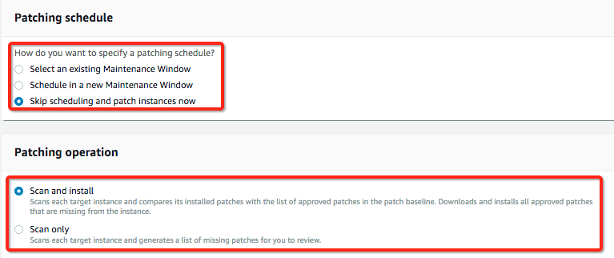

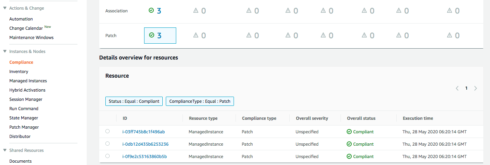

- State Manager - Allows you to configure a state that you want your instances to be in.  You are able to do by defining an Association which is made up of the following:
  - Document - which will dictate the state
  - Target - the hosts which you want to be in that state
  - Schedule - when to run the association

**SSM Secure Shell via Session Manager**
- A secure way to access your EC2 instances without the need to open port 22 or load SSH keys is via Session Manager
- It allows for all actions to be logged to S3 and Cloudwatch if you enable it and also the correct IAM permissions are in place
- Cloudtrail will also intercept StartSession events so you are able to track down who accessed what and when
- When accessing a host you do so via the SSM agent and access to hosts is controlled via IAM permissions
- Only works for EC2 at the moment but will also work for on-prem too in the future
- Under Session Manager you start a session

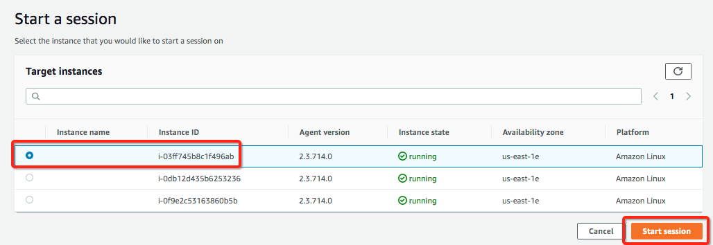

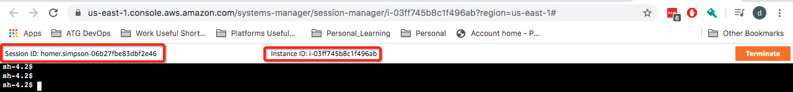

- Under Preferences you can enable the logging to S3 and Cloudwatch

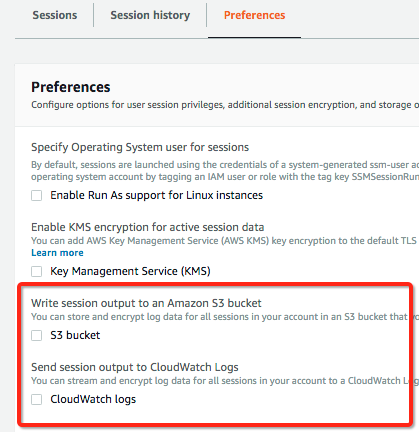

- Before you enable the Cloudwatch logs you will need to create a Log Group in Cloudwatch so you will be able to ship the logs to it

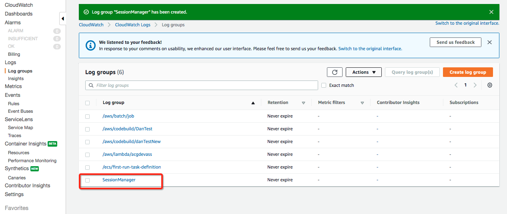

- Once created you can send the Session Manager logs to it

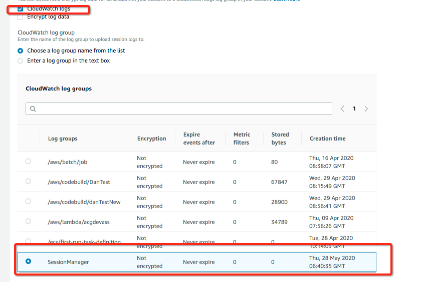

**What if I lose my SSH key**
- If you lost your private key for an EC2 EBS backed instance you are able to get access back by doing the following:
  - Option 1:
    - Stop the instance
    - Start a secondary instance with your new key loaded on there
    - Mount the root volume of the instance where you lost the key as a secondary volume on the secondary instance.  These are the commands I ran (had some issues that the drive had a duplicate UUID so I had to generate a new one and then change back before re-mounting
    ```bash
    sudo su - 
    fdisk -l
    lsblk
    xfs_admin -U generate /dev/xvdf1
    mount /dev/xvdf1 /mnt
    xfs_admin -U 55da5202-8008-43e8-8ade-2572319d9185 /dev/xvdf1
    ```
    - Add a new public to ~/.ssh/authorized_keys
    - Restart the primary instance

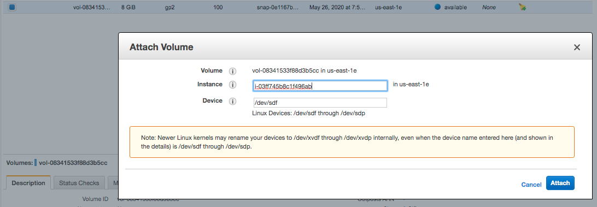
 
  - Option 2:
    - Choose AWSSupport-ResetAccess

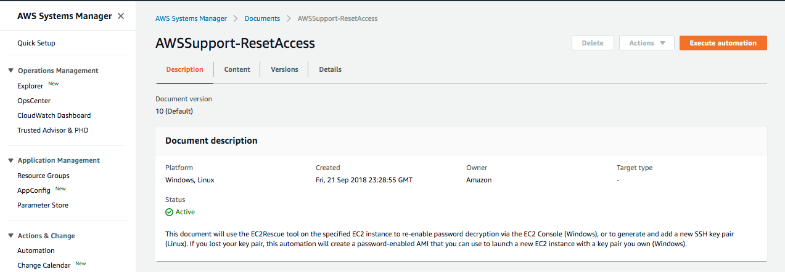

- If you lost your key to an Instance Store backed Instance you can:
  - Restart your instance
  - Use SSM to access the shell and change the contents of ~/.ssh/authorized_keys (this works for EBS backed instances too)

**SSM Parameter Store Overview**
- It is a secure store where you can place your configuration parameters along with their secrets
- You can encrypt secrets by leveraging KMS.  Once encrypted with a KMS key Parameter Store will talk directly to KMS to decrypt the secret for you providing your IAM user you are using has priviliges to do so

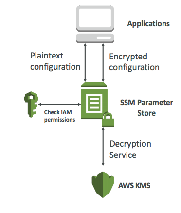

- It is a free service and serverless so it can scale infinitely
- As pointed out above you restrict access to Parameter Store via IAM permissions
- You can arrange your secrets and configurations by using a tree like structure so you can then reference the items in a similar fashion as you would access items on a FS.  As you can see below you could then have 2 separate lambda functions which could access different sections of the Parameter store to access what they need

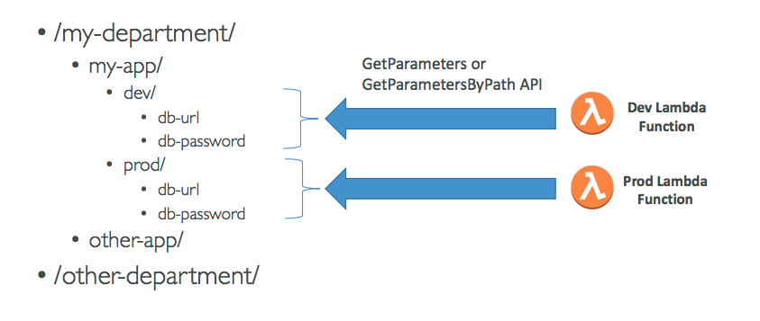

**SSM Parameter Store Lab**
- As a First step we created 4 Parameters split in the following way:
  - 2 x DB urls (prod/dev) non encrypted
  - 2 x BB passwords (prod/dev) encrypted via KMS
- This is an example of how you create a non encrypted item

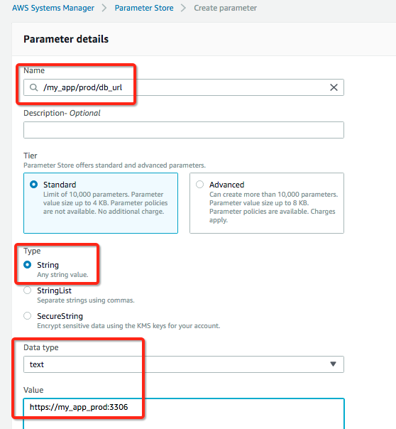

- This is how you create an encrypted item

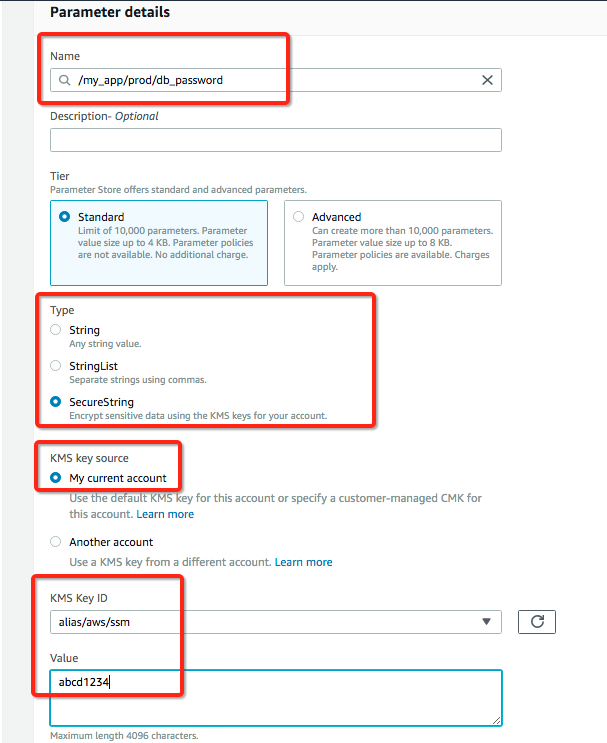

- This is how they will look

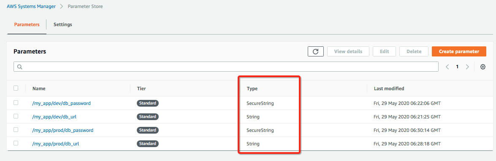

- As pointed out earlier you can do version control in Parameter store, below you can see how you can view the history of the item

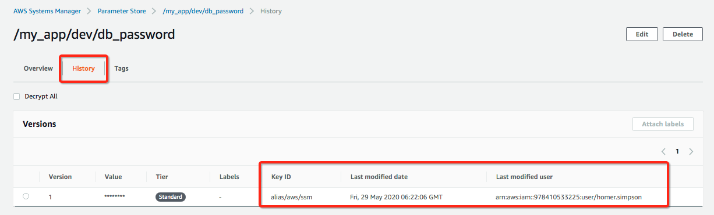

- Below you can see how I queried the Parameter store via the CLI to get the value of the items

```bash
ddamico@Danieles-MBP:~$ aws ssm get-parameters --names /my_app/dev/db_url
{
    "Parameters": [
        {
            "Name": "/my_app/dev/db_url",
            "Type": "String",
            "Value": "https://my_app_dev:3306",
            "Version": 1,
            "LastModifiedDate": "2020-05-29T07:21:25.656000+01:00",
            "ARN": "arn:aws:ssm:us-east-1:978410533225:parameter/my_app/dev/db_url"
        }
    ],
    "InvalidParameters": []
}
ddamico@Danieles-MBP:~$ aws ssm get-parameters --names /my_app/dev/db_password
{
    "Parameters": [
        {
            "Name": "/my_app/dev/db_password",
            "Type": "SecureString",
            "Value": "AQICAHhuRx+k300qQuiXu6xb482wDrb4AgZZh33Q9AThZBMDTgHalj1ntKM/DZebe0UDFfVEAAAAZjBkBgkqhkiG9w0BBwagVzBVAgEAMFAGCSqGSIb3DQEHATAeBglghkgBZQMEAS4wEQQMnDlvULXw2g0tpExZAgEQgCN3AgTRscVM5NUOJAHZJpGmR/tLU3kMGqglqFNUiC30QiJVFg==",
            "Version": 1,
            "LastModifiedDate": "2020-05-29T07:22:06.605000+01:00",
            "ARN": "arn:aws:ssm:us-east-1:978410533225:parameter/my_app/dev/db_password"
        }
    ],
    "InvalidParameters": []
}
```

- The second value above show how it is coming up as an encrypted value, if you want to decrypt it (under the covers Parameter store will directly contact KMS for you) you do the following

```bash
ddamico@Danieles-MBP:~$ aws ssm get-parameters --names /my_app/dev/db_password --with-decryption
{
    "Parameters": [
        {
            "Name": "/my_app/dev/db_password",
            "Type": "SecureString",
            "Value": "abdc1234",
            "Version": 1,
            "LastModifiedDate": "2020-05-29T07:22:06.605000+01:00",
            "ARN": "arn:aws:ssm:us-east-1:978410533225:parameter/my_app/dev/db_password"
        }
    ],
    "InvalidParameters": []
}
```

- Below is a different variation of querying the API via the CLI as we asking to return all Parameter items under /my-app and return all encrypted items as clear text

```bash
ddamico@Danieles-MBP:~$ aws ssm get-parameters-by-path --path /my_app --recursive --with-decryption
{
    "Parameters": [
        {
            "Name": "/my_app/dev/db_password",
            "Type": "SecureString",
            "Value": "abdc1234",
            "Version": 1,
            "LastModifiedDate": "2020-05-29T07:22:06.605000+01:00",
            "ARN": "arn:aws:ssm:us-east-1:978410533225:parameter/my_app/dev/db_password"
        },
        {
            "Name": "/my_app/dev/db_url",
            "Type": "String",
            "Value": "https://my_app_dev:3306",
            "Version": 1,
            "LastModifiedDate": "2020-05-29T07:21:25.656000+01:00",
            "ARN": "arn:aws:ssm:us-east-1:978410533225:parameter/my_app/dev/db_url"
        },
        {
            "Name": "/my_app/prod/db_password",
            "Type": "SecureString",
            "Value": "abcd1234",
            "Version": 1,
            "LastModifiedDate": "2020-05-29T07:30:14.091000+01:00",
            "ARN": "arn:aws:ssm:us-east-1:978410533225:parameter/my_app/prod/db_password"
        },
        {
            "Name": "/my_app/prod/db_url",
            "Type": "String",
            "Value": "https://my_app_prod:3306",
            "Version": 1,
            "LastModifiedDate": "2020-05-29T07:28:18.272000+01:00",
            "ARN": "arn:aws:ssm:us-east-1:978410533225:parameter/my_app/prod/db_url"
        }
    ]
}
```