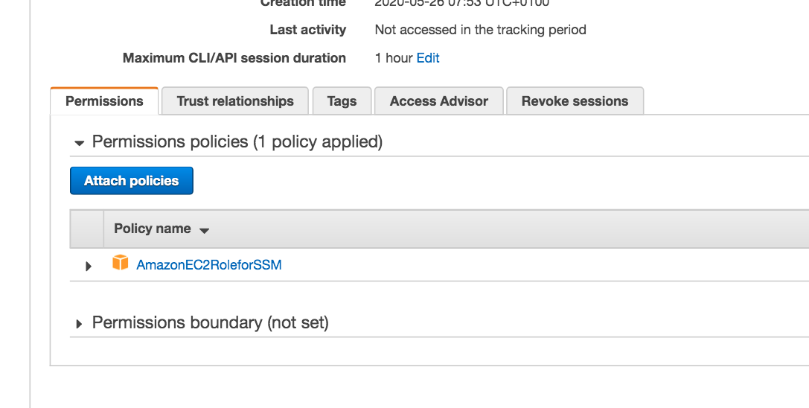
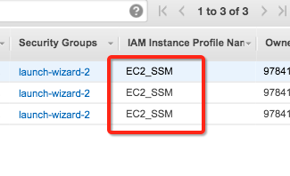
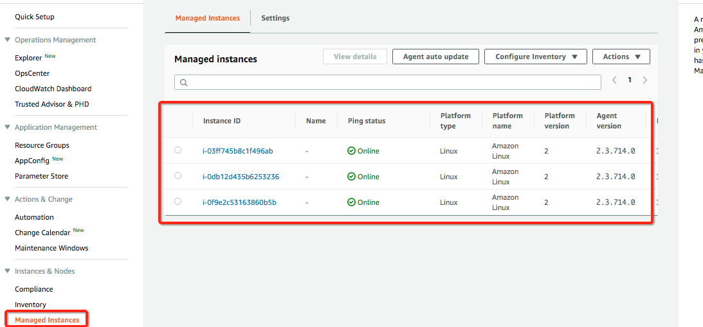
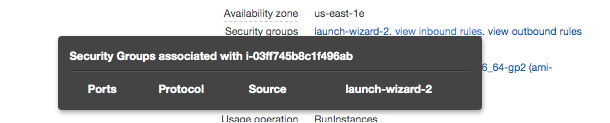
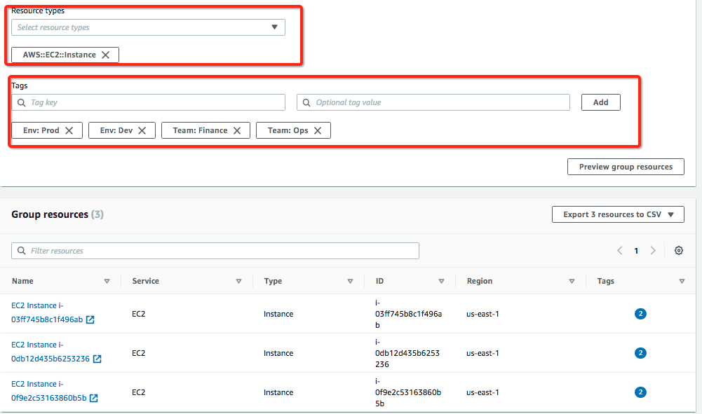

**SSM Oveview**

- It is a service that is designed to help manage EC2 and on-prem instances
- It allows for patch automation as well as operational insight for running instances
- Works for both Linux and Windows
- It integrates with other AWS services such as:
  - Config 
  - Cloudwatch
- It is a free service
- How it works:
  - First you need to instal an SSM agent onto your instances which will allow for communication back to the SSM service (this comes pre-built in AWS Linux AMI)
  - Once the SSM agent has been installed it will automatically be configured to talk back to the service.  If not then there is a comms issue or maybe the instance doesnt have the correct IAM permissions or the SSM agent is not running

**EC2 Instances with SSM**

- Here we demostrate how SSM works by creating 3 instances from AWS Linux AMI which have the SSM agent installed already
- Created a role in IAM for EC2 instances to be able to communicate with SSM

- Assigned to the instances

- I also created some test tags:
  - Team - Finance/Ops
  - Env - Prod/Dev

- Once the IAM role is in place the instances will talk back to SSM and show up under Managed Instances

- Just as a note I created the instances with a completely empty SG which means no traffic is allowed in to the instances.  The way that SSM works is via the the Agent installed on the instances thus requiring no SSH to be opened

**AWS Tags & Resource Groups**

- In the previous section I tagged the instances and those tags will help us interact with them via SSM, also the tags are useful for creating Resource Groups which are a way of logically partitioning instances

- Tags are used for the following (as a rule of thumb is better to have too many tags than too few):
  - Resource Groups
  - Cost Allocation
  - Automation
  - SSM

- Resource Groups are Region centric so you can’t create Resource Groups that span across multiple Regions

- I then created some Resource Groups which will include the tags that I previously assigned to the 3 test Instances

- Once you have Resource Groups created you can run Tasks against them in SSM.  Think of this like running a playbook against Instances in inventory in Ansible